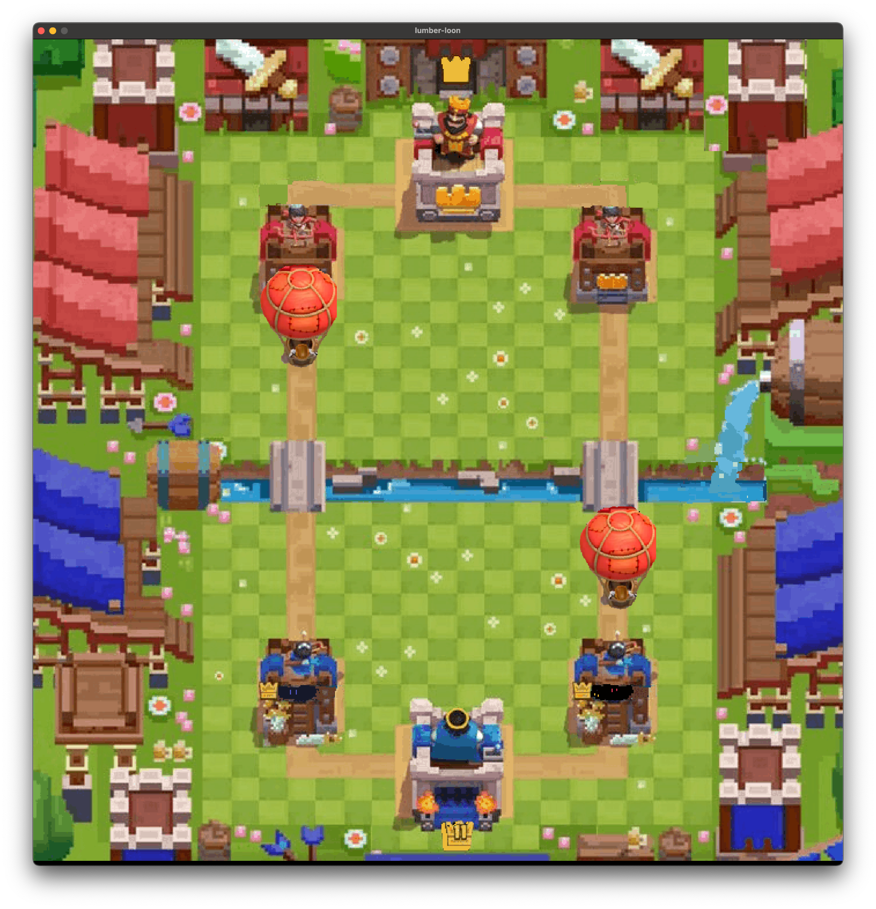

# My Hunter - Balloon Clicker Game

A simple clicker game built with CSFML where you need to pop balloons before they reach the top of the screen.



## Description

My Hunter is a graphical game where:
- Two animated balloons move up the screen
- Click on the balloons to pop them
- If balloons reach the top, they will explode in an animation
- Features background music and sound effects
- Built using the CSFML graphics library

## Requirements

- CSFML library
- C compiler (gcc)
- Make

## Building and Running

```bash
# Build the game
make

# Run the game
./my_hunter

# Show help
./my_hunter -h